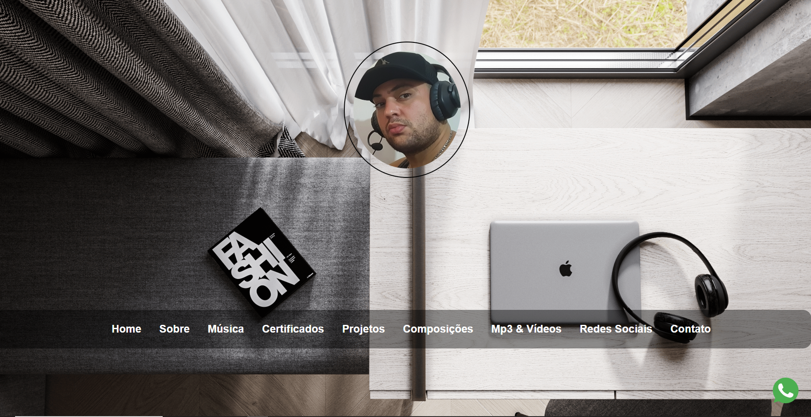
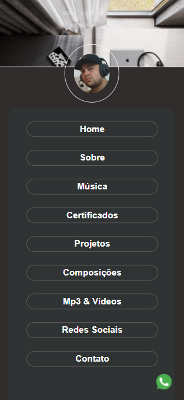

<h1>Link do projeto abaixo</h1>
<a href="https://portfolioaironys.netlify.app/" target="_blank" style="color:#0ed276; text-decoration: none; margin-left:30px; " >Ver projeto</a>

<h4 style="color:#00ffff" >Imagem do site, versão Descktop</h4>

<h4 style="color:#00ffff">Imagem do site, versão Mobile</h4>

